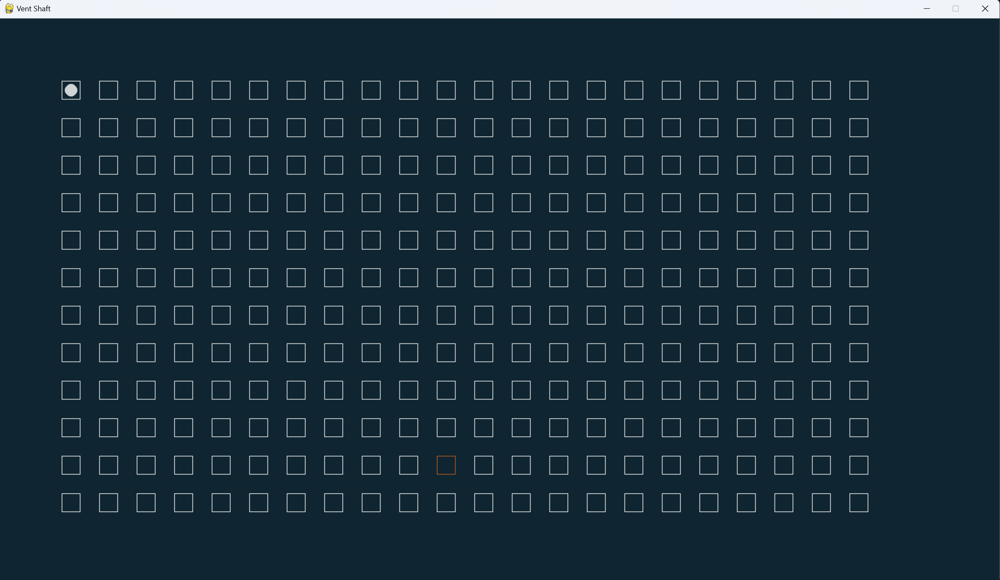

# Game_project
This is my first project on Python. I made it to improve and practice my object- oriented programming skills and have some fun. 

# Vent shaft
It is a simple 2D horror game(at least it is meant to be a horror game), where player has to escape from a vent shaft using different tools like radar and audio.

# Main features
1. Grid- base movement, the vent shaft includes many blocks
2. Monster reacts to player's actions
3. There are also radar and audio mechanics
4. Basic GUI with a play button

# Development and game run
I used Pycharm to write code for my game. I also installed pygame package to realise the game.

# Screenshot of the game

# Main goal
You start at the top-left corner of the map. The main goal is to fix the block that is orange on the map, find the exit and escape before the monster catches you. The monster itself spawns in a random block. On top of that, the vent shaft is assumed to be dark, so player can't see where is the exit and the monster.

# Rules
The game is based on turns(if you do something, then the monster moves). 
Your abilities:
1. By clicking to the nearby block with your mouse, you can move to that block. Each such a movement makes sound that attracts monster for 2 turns.
2. By pressing R, you can use a radar. Radar checks nearby blocks(3 x 3) and displays the exit or the monster for one turn in the grid if they are in the radar zone. You can use 20 radars in total, but only once in 2 turns.
3. By pressing v, you can play audio in any block(just hover over any block). The blocks will turn green and attract the monster for 4 turns. So, if the audio is active and you move, the monster will not follow you, but the block with the audio. You can use 10 audio in total, but once in 10 turns
4. By pressing y, you do nothing. This ability is needed when the monster is just one block away from you. If the monster right next to you and you do anything, but pressing y, you will die(the monster can hear you doing something in the close range). But if you press y, then the monster will go away and you will be safe.
